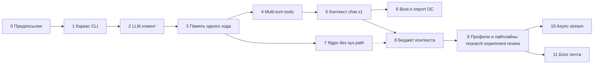

# План внедрения: нативный CLI и зрелое ядро Logos

Документ задаёт **поэтапный маршрут** от текущего состояния репозитория до «полной» реализации в смысле [CLI_ARCH.md](CLI_ARCH.md): свой CLI, контролируемый boot, multi-turn инструменты, затем рефактор памяти и внешние транспорты (блог, почта).

**Критерий успеха всего маршрута:** можно вести длительную сессию в `eidos.py chat`, пережить перезапуск процесса, опираться на память ядра, опционально импортировать старую сессию OpenCode **одной командой**, не зависеть от OpenCode в повседневном цикле; тесты и CI покрывают критический путь CLI + память.

---

## Фаза 0 — Предпосылки (частично сделано)

| Цель | Результат (definition of done) |
|------|------------------------------|
| Репроизводимые профили зависимостей | Каталог `requirements/` с `kernel-min`, `kernel-ml`, `cli`, `dev`, `full-local`; `body/requirements.txt` отсылает к нему |
| Архитектура зафиксирована | `CLI_ARCH.md` описывает транспорт, пайплайны, OpenCode import-only |
| Запуск кода из корня без установки пакета | В документированном виде: `PYTHONPATH=. python …` или будущий `pip install -e .` |

**Дальнейшие действий нет**, только поддерживать README/requirements в актуальности при добавлении зависимостей CLI.

---

## Фаза 1 — Каркас CLI (скелет без «умной» модели)

| Цель | Результат |
|------|-----------|
| Единая точка входа | Файл `eidos.py` в корне + пакет `cli/` |
| Подкоманды | `argparse`: хотя бы `chat` (цикл ввода), `boot` (печать заглушки или сырого `Memory().boot()`), `ask` (один проход с заглушкой ответа), заготовка под `sleep` / `import-opencode` |
| Зависимость от ядра | Импорт `Memory` без побочных ML-импортов при старте (не вызывать `external()` / тяжёлый journal до необходимости) |
| Дымовой тест | `tests/test_cli_smoke.py`: subprocess или импорт `cli.app.main` с `--help`; при необходимости mock LLM |

**Критерий готовности фазы:** `PYTHONPATH=. python eidos.py --help` и `chat` с Echo/mock проходят в CI без GPU и без torch.

---

## Фаза 2 — Клиент LLM и конфигурация

| Цель | Результат |
|------|-----------|
| Провайдер-агностичный конфиг | Env: `LLM_API_KEY`, `LLM_BASE_URL`, `LLM_MODEL` (или совместимый набор с DeepSeek по умолчанию в документации) |
| Реальный вызов API | Модуль `cli/llm.py`: синхронный `httpx` POST `/chat/completions` (или эквивалент), разбор JSON ответа |
| Безопасность | Ключ только из env / будущего `.env` (не логировать, не коммитить) |
| Тесты | Mock HTTP (например `httpx.MockTransport`) — один happy-path и один error-path |

**Критерий готовности:** `eidos.py ask "привет"` возвращает реальный ответ модели при заданном ключе (ручная проверка + mock в CI).

---

## Фаза 3 — Интеграция с памятью (один проход диалога)

| Цель | Результат |
|------|-----------|
| Запись пользователя и ассистента | После каждого хода: `WorkingMemory.add_event` / согласованная схема событий в WM |
| Сессия CLI | Файл в `data/cli_sessions/` (id, метаданные, ссылка на `session_id` в WM при необходимости) |
| Восстановление | Повторный `chat` подхватывает последнюю сессию или флаг `--session` |
| Минимальный boot | При старте `chat`: либо короткий текст из `BOOK`/последнего эпизода без полного токен-бюджета, либо явный вызов облегчённого пайплайна |

**Критерий готовности:** после двух реплик в WM есть записи; после выхода и нового запуска история доступна (хотя бы последние *N* событий).

---

## Фаза 4 — Multi-turn инструменты

| Цель | Результат |
|------|-----------|
| Протокол цикла | Реализация в `cli/runtime.py` + `cli/tools.py`: запрос → tool_calls → выполнение → повтор до финала |
| Реестр | Подключение к `InstrumentalRegistry`; хотя бы один безопасный инструмент (например `echo`/чтение файла из cwd с ограничениями) |
| Политика | Лимит раундов, таймауты, формат ошибки инструмента в историю для модели |
| Память | Сырые tool_calls и результаты попадают в WM/events |

**Критерий готовности:** сценарий с двумя раундами tool_calls проходит в тесте с зафиксированными stub-ответами модели.

---

## Фаза 5 — Пайплайн контекста «chat» v1

| Цель | Результат |
|------|-----------|
| Модуль `cli/context.py` | Явная функция вида `build_chat_context(memory, session, user_message) -> str` |
| Источники v1 | Хвост WM, опционально куск `boot_context` или упрощённый список принципов, без полной сборки из всех подсистем сразу |
| Отложено на фазу 8 | Грубый подсчёт токенов и суммаризация хвоста |

**Критерий готовности:** промпт для модели строится одним пайплайном; добавление нового источника (например `recall_by_cues`) не ломает остальной CLI.

---

## Фаза 6 — OpenCode только импорт; boot без скрытого OC

| Цель | Результат |
|------|-----------|
| Режим нативного boot | В `kernel/boot.py` и/или `Memory.boot()`: флаг или отдельная функция `boot_native_context()`, не вызывающая синхронизацию OC по умолчанию |
| Импорт сессии | Команда `eidos.py import-opencode`: перенос истории в episodic/WM по правилам из адаптера; однократная операция |
| Совместимость | Режим «legacy» или переменная окружения для тех, кто ещё живёт в OpenCode-first |

**Критерий готовности:** чистый каталог данных + нативный `boot` не требует наличия `opencode.db`; после `import-opencode` история видна в памяти.

---

## Фаза 7 — Укрепление ядра (убрать скрытые зависимости)

| Цель | Результат |
|------|-----------|
| Budget / verifier | Перенос модулей из `experiments/002-*`, `003-*` в `kernel/` (или `kernel/contrib/`) с нормальными импортами |
| Удаление `sys.path` хака из `Memory` | Явные импорты; версионирование поведения через конфиг |
| Тесты | Существующие тесты памяти и sleep проходят; новые тесты на импорт без experiments в PATH |

**Критерий готовности:** grep по `sys.path.insert` в `kernel/memory.py` не находит ссылки на experiments (или только документированный плагин-хук).

---

## Фаза 8 — Сборщик контекста с бюджетом

| Цель | Результат |
|------|-----------|
| Оценка размера | Примитивный token/char estimator для промпта и для слоёв |
| Слои | При нехватке места — компрессия старого хвоста WM через существующий `kernel/compress.py` или отдельный summarizer |
| Планы и слоты | В промпт попадают `attention_slots` и явный «план задачи», если хранятся в WM |

**Критерий готовности:** искусственно длинная история обрезается предсказуемо; тест на монотонность (больше бюджета → длиннее допустимый хвост).

---

## Фаза 9 — Профили агентов, backend’ы и именованные пайплайны

### 9a. Реестр профилей и Agent Backend

| Цель | Результат |
|------|-----------|
| Конфиг профилей | `data/config/agents.yaml` (шаблон в репо), поля `base_url`, `api_key_env`, `model`, таймауты |
| Единый вызов | Модуль `cli/agent_backends.py`: по имени профиля выполняется OpenAI-compatible `chat/completions` |
| Локальные модели | Профиль на `127.0.0.1` (Ollama / LM Studio / vLLM) без облака |
| Тесты | Mock HTTP; два профиля в фикстурах — оба проходят один и тот же код backend’а |

**Критерий готовности:** смена исполнителя с облака на локальный endpoint меняется только YAML + env, без правки кода пайплайна.

### 9b. Пайплайны research / experiment / code_review

| Цель | Результат |
|------|-----------|
| Контекст-пресеты | Отдельные функции/модули сборки контекста под исследование, эксперимент и ревью (разный состав памяти и бюджет) |
| Оркестрация этапов | Пакет `cli/pipelines/`: минимум три именованных сценария с цепочками (`draft → critique → synthesize` где уместно) |
| Мультиагент | На этапах указаны **разные** `agent_profile`; опционально параллельные критики с этапом слияния |
| CLI | `eidos.py run <pipeline>`, `eidos.py review --paths …` (после базового `cli` каркаса) |
| Этика / pulse / sleep | Явные вызовы после хода или по расписанию; не ломают формат основного вывода пайплайна |

**Критерий готовности:** один прогон `research` записывает эпизод с тегами; `code_review` на тестовом файле вызывает минимум два разных профиля (или два последовательных этапа с разными профилями) в CI через mock.

### 9v. Внешние процессы и MCP (позже)

| Цель | Результат |
|------|-----------|
| Subprocess backend | JSON envelope stdin/stdout для произвольного «агента» |
| MCP | По необходимости отдельный backend-адаптер без смешения с ядром памяти |

---

## Фаза 10 — Async, стриминг, UX

| Цель | Результат |
|------|-----------|
| Async runtime | Перевод `cli/llm.py` и точек ожидания I/O на asyncio по мере необходимости |
| Стриминг токенов | Опциональный флаг `--stream` в `chat` и при необходимости в этапах пайплайнов |
| Параллельный сбор контекста и рецензентов | `asyncio.gather` с лимитами при активированном async-слое |

**Критерий готовности:** измеримое снижение латентности до первого токена или до полного контекста на сценарии с 2+ источниками.

---

## Фаза 11+ — Внешние каналы (из CLI_ARCH)

| Цель | Результат |
|------|-----------|
| Летопись на GitHub | Явная публикация черновика в отдельный репо/ветку; политика секретов |
| Почта | Транспорт входа/выхода + очередь human approval |

Зависят от стабильного **Фаз 5–10** и явных границ «что можно отправить наружу».

---

## Зависимости между фазами (сжато)

Фазу 7 можно начинать параллельно с 5–6, но завершать до того, как бюджет контекста (8) станет сложным.

---

## Что делать следующим шагом (конкретно)

1. Реализовать **Фазу 1** (структура `cli/`, `eidos.py`, smoke test).
2. Затем **Фазу 2** (реальный LLM для `ask`).
3. Затем **Фазу 3** (WM + session JSON).

После этого продукт уже «полезен ежедневно»; фазы 4–6 убирают главные архитектурные долги относительно OpenCode и инструментов.
